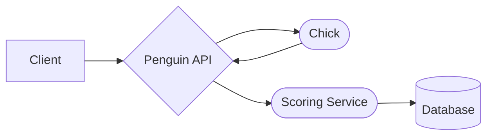
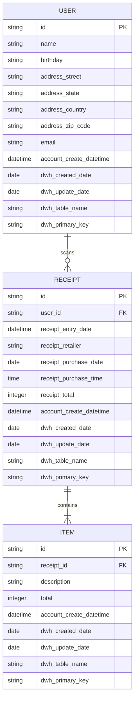

# Penguin

Penguin is a Fetch Rewards App copycat. The service allows a user to scan a receipt and gain points based on our scoring criteria. This document serves as an outline to the project.

## Architecture

This is a python-based project that uses FastAPI endpoints to connect to the scoring service backend. The user takes a photo of their receipt, the information is processed by Chick, the image processing service, scored, and saved in the backend. Once the receipt is processed, the score is returned to the client.

## Database

The database uses a SQL-style approach with three tables: USER, RECEIPT, and ITEM. The schema (attempts) at 3NF, relating `user_id` between USER and RECEIPT tables and `receipt_id` between RECEIPT and ITEM tables.

